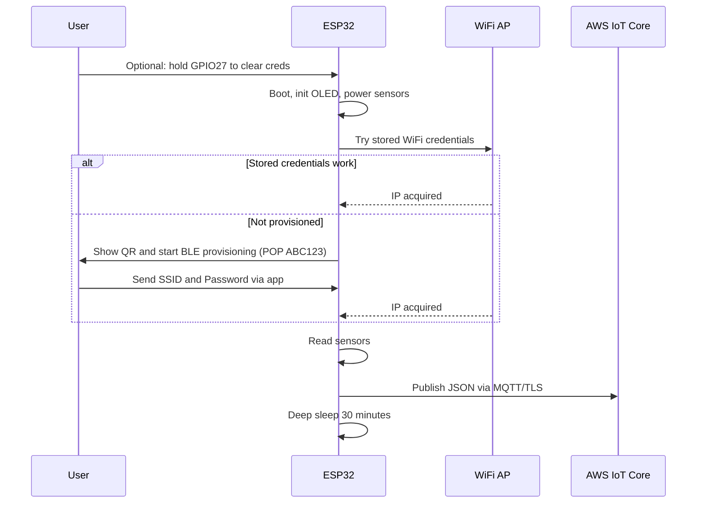
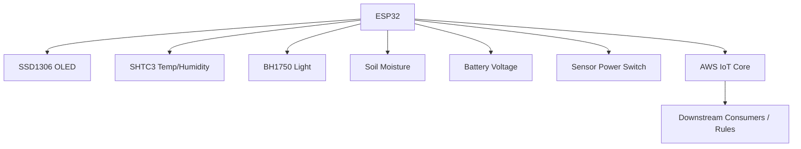
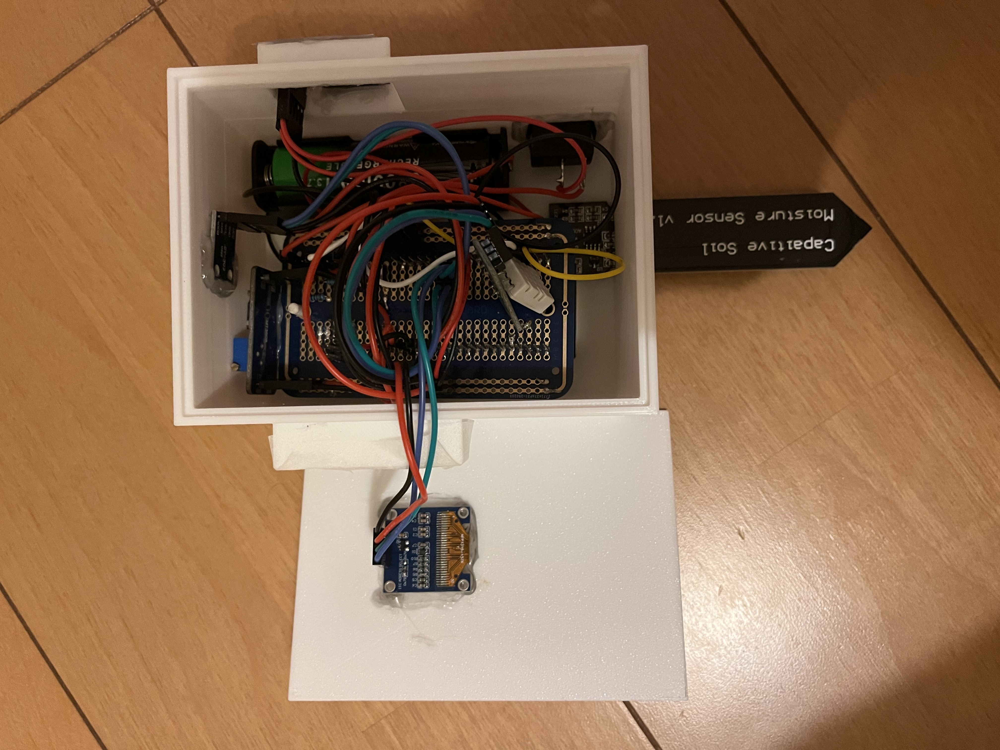

# Talking Plants Device (ESP32 → AWS IoT)

This repo contains the firmware for a low‑power ESP32 device that reads plant‑related environmental data and publishes it securely to AWS IoT Core using MQTT over TLS. It supports BLE‑based Wi‑Fi provisioning, shows status on a small OLED display, and sleeps between readings to save battery.

This repo works together with app and backend that are discussed in this repo: https://github.com/nelsongcg/talking_plants_app

## What It Does
- Reads temperature and relative humidity (SHTC3), ambient light (BH1750), soil moisture (analog), and battery voltage.
- Displays current readings and status on a 0.96" 128×64 SSD1306 OLED.
- Connects to Wi‑Fi via ESP BLE Provisioning (scan QR, enter SSID/PSK in the mobile app).
- Publishes a JSON payload to AWS IoT Core via MQTT/TLS (port 8883).
- Deep‑sleeps for 30 minutes between measurements to conserve power.

## Hardware Components
- ESP32 development board (Arduino‑compatible).
- OLED display: SSD1306 128×64, I2C at `0x3C`.
- Temperature/Humidity: Adafruit SHTC3 (I2C).
- Light: BH1750 (I2C).
- Soil moisture: Capacitive analog sensor to `GPIO34`.
- Battery sensing: Voltage divider into `GPIO35` (R1=10k, R2=1k → 11× divider).
- Sensor power switch: `GPIO25` drives a transistor to power sensors.
- Clear‑credentials button: `GPIO27` to 3V3 (uses internal pulldown).

## Pinout (ESP32)
- I2C: `GPIO21` (SDA), `GPIO22` (SCL) → OLED, SHTC3, BH1750.
- Soil moisture (analog): `GPIO34`.
- Battery ADC: `GPIO35` via divider (R1=10k to VBAT, R2=1k to GND).
- Sensor power switch: `GPIO25` (HIGH = sensors on).
- Clear Wi‑Fi button: `GPIO27` (press pulls HIGH for 3s during boot).

## Data Schema (MQTT Payload)
Topic: `esp32/pub`

```json
{
  "temperature": 24.1,
  "relativeHumidity": 52.3,
  "luminosity": 123.4,
  "soilmoisture": 45,
  "sensoridentification": "AA:BB:CC:DD:EE:FF",
  "batvoltage": 3.98,
  "batpercent": 76.5
}
```

The device also subscribes to `esp32/sub` and logs any incoming messages.

## High‑Level Flow



## Architecture



## Photos

<p>
  <a href="images/IMG_9722.jpg" target="_blank">
    
  </a>
  <a href="images/IMG_9723.jpg" target="_blank">
    
  </a>
  
</p>

## How The Code Works
- Provisioning: Uses ESP BLE Provisioning (`WiFiProv`) with service name `ITTP` and POP `ABC123`. See `sketch_v2/sketch_v2.ino:200` for `startProvisioning()` and the event handler at `sketch_v2/sketch_v2.ino:376`.
- Wi‑Fi connect: Tries stored credentials first (`attemptWiFiConnect()`), otherwise starts provisioning. See `sketch_v2/sketch_v2.ino:191` and `sketch_v2/sketch_v2.ino:520`.
- Sensors: Initializes I2C bus, then SHTC3 and BH1750. Soil moisture read from `GPIO34`, mapped to 0–100% based on calibrated raw range. See `sketch_v2/sketch_v2.ino:240`–`sketch_v2/sketch_v2.ino:307`.
- Battery: Reads ADC on `GPIO35` with 11 dB attenuation and converts to voltage using the 11× divider, then estimates percentage with a simple linear model. See `sketch_v2/sketch_v2.ino:460`–`sketch_v2/sketch_v2.ino:472`.
- Display: `oledMessage()` prints status and readings. See `sketch_v2/sketch_v2.ino:452`.
- AWS IoT: Configures `WiFiClientSecure` with CA, device cert, and private key from `sketch_v2/secrets.h`; uses `PubSubClient` to connect to the endpoint on port 8883; publishes JSON to `esp32/pub`. See `sketch_v2/sketch_v2.ino:155`–`sketch_v2/sketch_v2.ino:185` and `sketch_v2/sketch_v2.ino:343`–`sketch_v2/sketch_v2.ino:364`.
- Power: After publishing, turns OLED off and enters deep sleep for 30 minutes (`SLEEP_US`). See `sketch_v2/sketch_v2.ino:366`–`sketch_v2/sketch_v2.ino:371`.

## AWS IoT Setup
1. Create an AWS IoT Thing, keys, and X.509 certificates; attach a policy that allows `iot:Connect`, `iot:Publish` to `esp32/pub`, and `iot:Subscribe/Receive` to `esp32/sub`.
2. Note your AWS IoT endpoint (e.g., `xxxxx-ats.iot.us-east-1.amazonaws.com`).
3. Paste endpoint, CA cert, device cert, and private key into `sketch_v2/secrets.h` and set a `THINGNAME`.
4. Build and flash the firmware.

Security note: Never commit real device certificates or private keys to a public repo.

## Build and Flash
Prerequisites (Arduino):
- ESP32 Arduino core installed.
- Libraries: Adafruit GFX, Adafruit SSD1306, Adafruit SHTC3, BH1750, PubSubClient, ArduinoJson. `WiFiProv` and `esp_adc_cal` are included with the ESP32 core.

Using Arduino CLI:

```bash
arduino-cli compile \
  --fqbn esp32:esp32:esp32 \
  --board-options PartitionScheme=huge_app \
  -v \
  sketch_v2 && \
arduino-cli upload \
  --fqbn esp32:esp32:esp32 \
  --port /dev/tty.wchusbserial110 \
  sketch_v2
```

## Provisioning (First‑Time Wi‑Fi)
1. Power the device. During boot, hold the button on `GPIO27` for 3 seconds to clear stored Wi‑Fi credentials (optional).
2. If not already provisioned, the device starts BLE provisioning and prints a QR code string to Serial; use the “ESP‑BLE‑Provisioning” mobile app.
3. In the app, select the device with service name `ITTP`, POP `ABC123`, then enter your SSID and password.
4. When provisioned, the device connects to Wi‑Fi, reads sensors, publishes to AWS, shows status on the OLED, and goes to deep sleep.

## Calibration Notes
- Soil moisture mapping uses raw ADC values with `map(1350, 3050 → 100%, 0%)`. Adjust `1350`/`3050` for your sensor and soil type.
- Battery percentage is a simple linear model from 2.75 V → 0% to 4.20 V → 100%; adjust for your chemistry and cutoff.

## Folder Structure
- `sketch_v2/` Main firmware (Arduino sketch, `secrets.h`, optional `partitions.csv`).
- `sketch_v1/` Earlier version kept for reference.

## Troubleshooting
- TLS connect fails: ensure correct endpoint and valid time; some TLS stacks require a set RTC. If needed, add NTP time sync before connecting.
- Provisioning fails: ensure 2.4 GHz Wi‑Fi, correct SSID/PSK, and strong signal. The app displays detailed failure reasons.
- No sensor data: verify I2C wiring (SDA=21, SCL=22), power switch on `GPIO25` is HIGH, and addresses are correct (OLED 0x3C).
